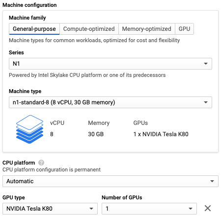
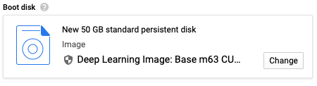
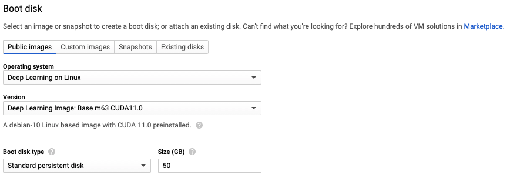

# Bring Your Own Compute

Beaker supports hosting your own compute resources. You can manage a single machine (node) or
manage many nodes under one or more clusters.

## Pre-requisites

1. Only Linux operating systems with systemd are supported.
1. Docker must be installed.

## Setup

1. If you haven't already, please [install and configure](install.md) Beaker.
   You can confirm whether Beaker is installed by running `beaker --version`

1. Each node belongs to a cluster. A cluster is a grouping of machines (nodes) used for scheduling
   jobs. Jobs may run on any node in their assigned cluster. If you don't
   [already have one](https://beaker.org/clusters), you'll need to create a cluster.

   ```
   beaker cluster create <account>/<name>
   ```

   The account may be an individual account or an organization. It should be the same account under
   which you plan to run experiments. Clusters may be used by any member of their associated account.

1. Beaker requires an agent (executor) to manage jobs on each node. The executor coordinates with
   [beaker.org](https://beaker.org/clusters), starts jobs, and monitors their execution. The
   executor is also responsible for capturing and uploading results.

   Beaker offers a command to install and configure the executor as a systemd service.

   ```bash
   sudo beaker executor install <account/cluster>
   ```

1. Run a test job to ensure your cluster is working. Replace ```<cluster>``` with the name of the
   cluster you created above.

   Test GPU access:
   ```bash
   cat > count.yaml << EOF
   version: v2-alpha
   description: nvidia-smi
   tasks:
   - name: nvidia-smi
     image:
       docker: nvidia/cuda:11.2.0-base
     command: [nvidia-smi]
     result:
       path: /output
     resources:
       gpuCount: 1
     context:
       cluster: <cluster>
   EOF
   ```

   Test CPU-only:
   ```bash
   cat > count.yaml << EOF
   version: v2-alpha
   tasks:
   - name: count-words
     image:
       beaker: mywordcount
     datasets:
     - mountPath: /input
       source:
         beaker: examples/moby
     result:
         path: /output
     context:
         cluster: <cluster>
   EOF
   ```

### Management

See `beaker executor -h` for all available executor management commands.

The executor is run through the `beaker-executor` systemd service
so all systemd commands are available.
Some useful ones include `systemctl status beaker-executor` to see if the executor is running
and `journalctl -u beaker-executor` to see the executor's logs.

### Installation on Google Cloud

If you need to run an experiment in a zone other than us-west1-b (Beaker's zone)
or use a machine configuration that Beaker doesn't support,
you can run the Beaker on your own Google Cloud VM instance.

#### Create an Instance

First, go to the [instance creation page](https://console.cloud.google.com/compute/instancesAdd)
and select a name and region for your instance.
Machines in us-west1-b will have the best performance because that is where
the Beaker API is hosted and where Beaker datasets are stored.

Next, configure your machine.
If using a GPU, you must select the "N1" series under "Machine configuration".
GPUs are not available with other series as of 2/12/2021.



Finally, change the boot disk.
Google provides images that already have the prerequisites for Beaker installed:
Docker, CUDA drivers, and the NVIDIA Container Toolkit.



Select the "Deep Learning on Linux" operating system
and the "Deep Learning Image: Base m63 CUDA11.0" version.
Other versions with PyTorch and Tensorflow are also available but these are not necessary
because those libraries are already included in the Beaker images.



Click "Create" and wait for your instance to come up.

#### Connect to the Instance

The easiest way to connect to the instance is with SSH through the
[gcloud command](https://cloud.google.com/sdk/gcloud).

You may need to be on the VPN and use the `--internal-ip` flag depending on how
networking is configured for your Google Cloud project.

```
gcloud compute ssh <instance>
```

When prompted to install the NVIDIA drivers, select yes.

## Removal

A machine can be removed from the pool with `beaker executor stop` or permanently removed with
`beaker executor uninstall`.
